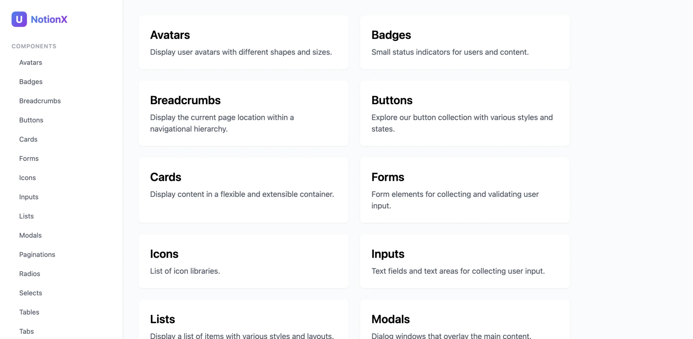

  
  
  # NotionX Tailwind Blocks

  

    <strong>Production-ready Tailwind CSS components. No installation required.</strong>
  

  

    Copy. Paste. Ship. Beautiful UI components in seconds.
  

  
  
  
  
  

## ⚡ The Fastest Way to Beautiful UIs

Skip the setup. Forget about installing packages. NotionX Tailwind Blocks gives you:

- 🚀 **Just Copy & Paste** - No npm install, no dependencies
- 💅 **Production-Ready Design** - Professionally crafted components
- 📱 **Responsive by Default** - Looks great on any device
- ♿ **Accessible Components** - Built following WCAG guidelines
- 🎯 **Zero Config** - Works with any Tailwind CSS project
- ⚡ **Instant Usage** - No build steps, no compilation needed

## 🎯 Perfect For

- 🏃‍♂️ **Rapid Prototyping** - Build MVPs and prototypes at lightning speed
- 🎨 **Design Systems** - Start with battle-tested components
- 🚀 **Landing Pages** - Create stunning marketing pages in minutes
- 💼 **Business Websites** - Professional components for company sites
- 📱 **Web Applications** - Essential UI building blocks for any web app

## 🚀 Getting Started

1. Make sure you have Tailwind CSS installed in your project
2. Browse our component library
3. Find a component you like
4. Copy the code
5. Paste into your project
6. That's it! No really, that's all you need to do 🎉

## 🎨 Component Categories

- **Avatars** - User profiles and image displays
- **Badges** - Status indicators and labels
- **Breadcrumbs** - Navigation trails
- **Buttons** - Actions and links
- **Cards** - Content containers
- **Forms** - User input collections
- **Inputs** - Text fields and controls
- **Lists** - Content organization
- **Modals** - Overlay dialogs
- **Tables** - Data presentation
- **Tabs** - Content organization
- **Toggles** - Interactive controls
- And many more, with new components added regularly!

## 🧞 Commands

All commands are run from the root of the project, from a terminal:

| Command                   | Action                                           |
| :------------------------ | :----------------------------------------------- |
| `npm install`             | Installs dependencies                            |
| `npm run dev`             | Starts local dev server at `localhost:4321`      |
| `npm run build`           | Build your production site to `./dist/`          |
| `npm run preview`         | Preview your build locally, before deploying     |
| `npm run astro ...`       | Run CLI commands like `astro add`, `astro check` |
| `npm run astro -- --help` | Get help using the Astro CLI                     |

